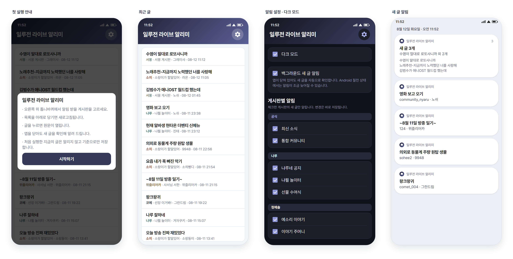
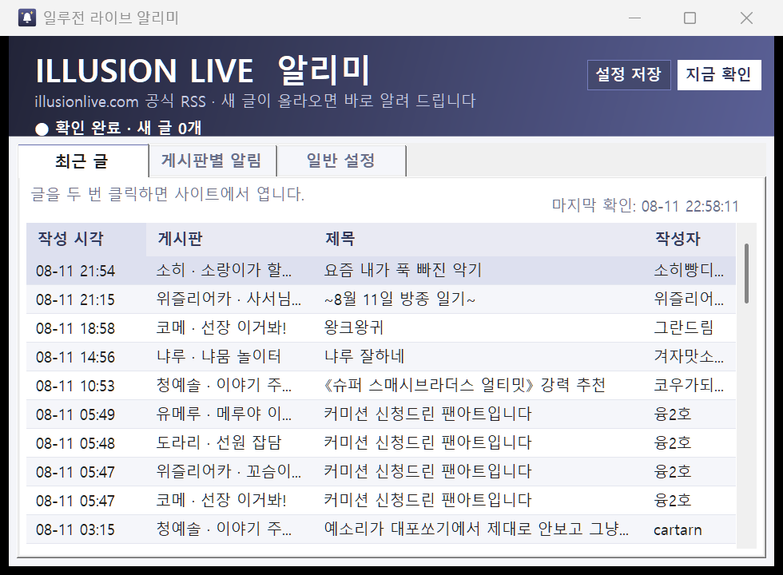

# 일루전 라이브 알리미

`illusionlive.com` 공식 RSS를 확인해 새 게시글을 알려 주는 Android 앱입니다.



## 기능

- 새 글 자동 확인 및 Android 알림
- 게시판별 알림 켜기/끄기
- 앱을 닫아도 백그라운드에서 새 글 자동 확인
- 최근 글 목록에서 원문 바로 열기
- 다크 모드 (기본값은 시스템 설정을 따름)
- 첫 실행 시 기존 글은 알리지 않고 기준점만 저장

## 설치

1. [최신 릴리스](https://github.com/soomin-319/IllusionLive-Notifier/releases/latest)에서 `IllusionLiveNotifier.apk`를 Android 기기로 내려받아 실행
2. 요청되면 **이 출처의 알 수 없는 앱 설치** 허용
3. 앱 실행 후 **알림 권한** 허용
4. 오른쪽 위 톱니바퀴에서 알림 받을 게시판 선택

요구 버전: Android 8.0 (API 26) 이상.

APK는 로컬 자체 서명 빌드입니다. Play Store 배포본이 아니라서 설치 시 경고가 표시될 수 있습니다. 각 릴리스 노트에 APK의 SHA-256 해시와 서명 인증서 지문이 적혀 있으니 확인한 뒤 설치하거나, 아래 명령으로 직접 빌드하세요.

## 직접 빌드

요구 사항: JDK 17, Android SDK Platform/Build Tools 36

```powershell
$env:ILLUSIONLIVE_KEYSTORE_PASSWORD = '<서명 키 비밀번호>'   # 없으면 키스토어와 함께 새로 만들어집니다
./build-android.ps1
```

결과물: `android-dist/IllusionLiveNotifier.apk`

## 데이터

- 읽기: `https://www.illusionlive.com/rss`
- 설정은 기기 안에만 저장
- 별도 서버, 계정 수집, 추적 없음

Android 절전 정책에 따라 백그라운드 확인 시각이 늦어질 수 있습니다. 사이트 RSS에 노출되지 않는 비공개·회원 전용 글은 감지할 수 없습니다.

## Windows 버전

같은 기능의 Windows 트레이 앱도 함께 들어 있습니다. 요구 사항: Windows 10/11 x64, .NET 10 SDK

```powershell
./build.ps1
```

`dist/IllusionLiveNotifier.exe`를 실행하고 **게시판별 알림** 탭에서 게시판과 키워드를 설정한 뒤 **설정 저장**을 누릅니다. 창을 닫아도 알림 영역에서 계속 실행되며, 완전 종료는 종 아이콘 우클릭 → **종료**입니다.


